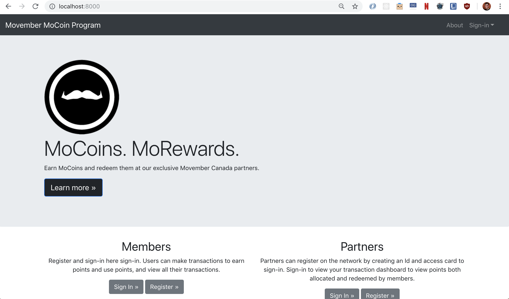

# Movember MoCoin Loyalty Program

Demo App: See [escakot/Movember-Loyalty-App](https://github.com/escakot/Movember-Loyalty-App) repository for our front-end demo.

Our proposed blockchain loyalty model brings new value to donors and participants, and rewards those who frequently participate and engage with the Foundation. Users of the Movember app would be able to earn points for actions/activities, which can translate into some type of reward such as discounts or freebies with partners.  Members work toward a certain amount of points to redeem their reward, and rewards offered by partners could be added on a time-limited or ad-hoc basis to further encourage activity. We believe this model would be successful at shaping user behaviour to engage with the Foundation beyond the traditional time of peak activity.

We conceptualize that coins could be awarded to users for various activities:
  - Initial app download/install
  - Referring a member to join
  - Opening the Movember app each day consecutively
  - Making a number of posts or updates to a MoSpace
  - Clicking a link in a targeted email campaign
  - Social media engagement: e.g. Retweet or use of a unique hashtag.
  - Reading/consuming promotional or health-related content on Movember.com
  - Attending a Movember themed event or gala
  - Other time-limited contests

  

# The Nitty Gritty

## Architecture

<p align="center">
  
</p>

**Note** The blockchain network will have multiple members and partners

1. Member is registered on the network
2. Member can sign-in to make transactions to earn points, redeem points and view their transactions
3. Partner is registered on the network
4. Partner can sign-in to view their transactions and display dashboard

## Overview
Users of the Movember Foundation's mobile app can be identified on the blockchain network with their existing user ID/primary key and will create a access key which they will use to sign in.  This access key is used as the card id for the member to make transactions and query records.  The member once signed in, can make transactions to earn points and redeem points from the partners on the network. They can view their transactions as part of the blockchain ledger.  This code pattern illustrates the use of permissions as part of the network where a member can only view their transactions.

Corporate Partners can register by creating an identity on the network and an access key which will be used to view their records.  Partners are allowed to view only transactions they were part of, and thus can keep track of all their transactions where they allocated or redeemed points.  The Express.js web application shows a basic dashboard for the partner displaying the total points that they have allocated and redeemed to members. As transactions get complex, the partner can perform analysis on their transactions to create informative dashboards.


## Technology Stack

* [Hyperledger Composer v0.19.4](https://hyperledger.github.io/composer/latest/) An open source framework to develop blockchain applications.
* [Hyperledger Fabric v1.1](https://hyperledger-fabric.readthedocs.io) Distributed ledger platform.
+ [Nodejs](https://www.nodejs.org/)
+ [Bootstrap CSS](https://getbootstrap.com/)

## Running the Application

Follow these steps to setup and run this code pattern. The steps are described in detail below.

### Prerequisite
- [npm](https://www.npmjs.com/)  (v5.x)
- [Node](https://nodejs.org/en/) (version 8.9 or higher - note version 9 is not supported)
* to install specific Node version you can use [nvm](https://davidwalsh.name/nvm)

  Example:
  + 1. `nvm install 8.9.4`
  + 2. `nvm use v8.9.4`
  + 3. Output `Now using node v8.9.4 (npm v6.1.0)`
- [Hyperledger Composer](https://hyperledger.github.io/composer/installing/development-tools.html)
  * to install composer cli
    `npm install -g composer-cli@0.19.4`
  * to install composer-rest-server
    `npm install -g composer-rest-server@0.19.4`
  * to install generator-hyperledger-composer
    `npm install -g generator-hyperledger-composer@0.19.4`

### Steps
1. [Clone the repo](#1-clone-the-repo)
2. [Generate the Business Network Archive](#2-generate-the-business-network-archive)
3. [Deploy Network](#3-deploy-network)
      - [Deploy to Fabric locally](./docs/deploy-local-fabric.md)
      - [Deploy to IBM Blockchain Starter Plan](./docs/deploy-ibm-starter.md)
4. [Run Application](#4-run-application)


### 1. Clone the repo

Clone the `Customer Loyalty Program with Blockchain` repo locally. In a terminal, run:

`git clone https://github.com/IBM/customer-loyalty-program`

### 2. Generate the Business Network Archive

Next we will generate the Business Network Archive (BNA) file from the root directory.  
This file will contain your network including:
- the model defined in the `org.clp.biznet.cto` file in the `models` folder
- the logic behind transactions in the `logic.js` file in the `lib` folder
- permissions defined in the `permissions.acl` file
- queries defined in the `queries.qry` file

Run the following the command to create the bna file:
```
cd customer-loyalty-program/
npm install
```

The `composer archive create` command in `package.json` has created a file called `clp-network@0.0.1.bna`.   


### 3. Deploy Network

The bna can be deployed to a local instance of Fabric or can use IBM Blockchain Starter Plan.

- [Deploy to Hyperledger Fabric locally](./docs/deploy-local-fabric.md)
- [Deploy to IBM Blockchain Starter Plan](./docs/deploy-ibm-starter.md)


### 4. Run Application

Go into the `web-app` folder and install the dependency:

```
cd web-app/
npm install
```

Start the application:
```
npm start
```

The application should now be running at:
`http://localhost:8000`

<div style='border: 2px solid #f00;'>
  
</div>
</br>

## Links
* [Hyperledger Fabric Docs](http://hyperledger-fabric.readthedocs.io/en/latest/)
* [Hyperledger Composer Docs](https://hyperledger.github.io/composer/latest/introduction/introduction.html)
* [Demo on Youtube](https://youtu.be/nLHBmPQa_FY)

## License
[Apache 2.0](LICENSE)
